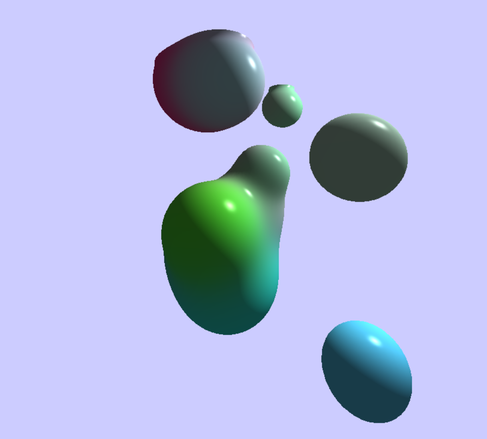

# WATER

Динамическая поверхность воды над плоской поверхностью дна с диффузным освещением от солнца.  
Высота и нормали вершин вычисляются на основе сумм синусоид.  
На воде есть отражения и преломления, коэффициенты взяты из аппроксимации Шлика уравнений Френеля.  
Угол преломлённого луча вычисляется через закон Снеллиуса.  
На дне есть каустики от солнца, они видны на самом дне, и через воду. Каустики рисуются отдельным проходом в особую текстуру аддитивным
блендингом: вершинный шейдер превращает каждую вершину в точку на дне, в которую попадает преломлённый луч от солнца.

# METABALLS

Динамическая сцена, набор трёхмерных шариков, движущихся в 3D.  
Изоповерхность функции f (p) = K с настраиваемым значением K, цвета интерполируются с softmax-весами.  
Функция и цвета хранятся как 3D текстура и обновляются на каждый кадр compute shader’ом.  
Изоповерхность рисуется по квадратной сетке алгоритмом marching tetrahedra в геометрическом шейдере.  
У поверхности есть нормали и освещение по Фонгу (со specular составляющей).  
